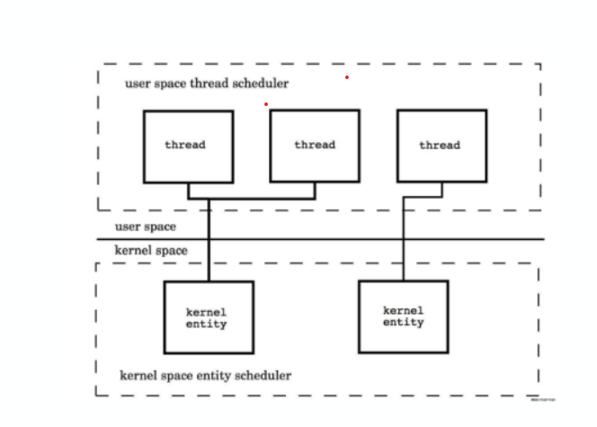
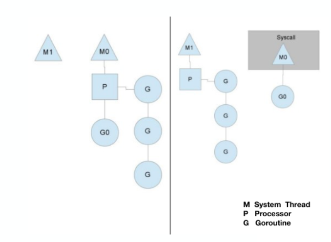

# 协程机制

## Thread vs Coroutine

1. 创建时默认的stack的大小
    - JDK以后的 Java Thread Stack 默认为 1M
    - Coroutine 的 Stack 默认大小为 2k
2. 和KSE(Kernel Space Entity)的对应关系
    - Java Thread 1:1
    - Coroutine M:N

  
  
