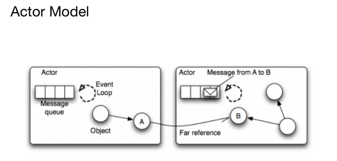
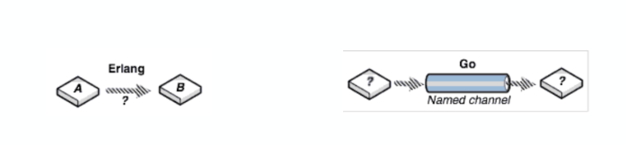
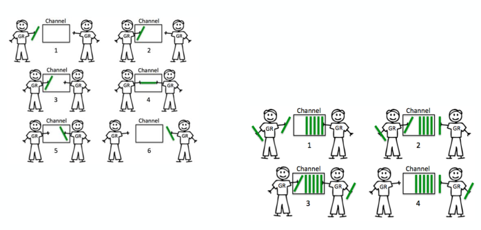

# CSP (Communicating sequential process)

## Actor

  

## CSP vs Actor

1. 和Actor的直接通讯不同，CSP模式则是通过Channel进行通讯的，耦合更松一些

2. Go中channel是有容量限制并且独立处理Groutine,  而如Erlang, Actor中的mailbox容量是无限的，接收进程也总是被动处理消息

  

## channel

  

